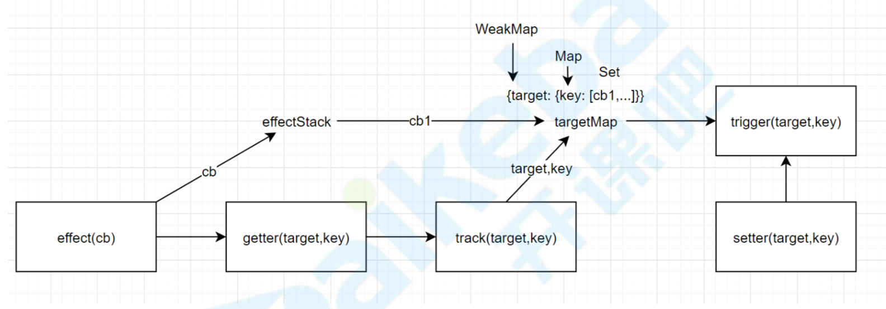

> vue2响应式弊端:
> + 响应化过程需要递归遍历，消耗较大 
> + 新加或删除属性无法监听 
> + 数组响应化需要额外实现 
> + Map、Set、Class等无法响应式 
> + 修改语法有限制

## vue3使用ES6的Proxy特性来解决这些问题。

### 设计

实现三个函数:  
`effect`: 将回调函数保存起来备用，立即执行一次回调函数触发它里面一些响应数据的getter  
`track`: getter中调用track，把前面存储的回调函数和当前target,key之间建立映射关系  
`trigger`: setter中调用trigger，把target,key对应的响应函数都执行一遍

target,key和响应函数映射关系  

{target: {key: [effect1,...]}}
